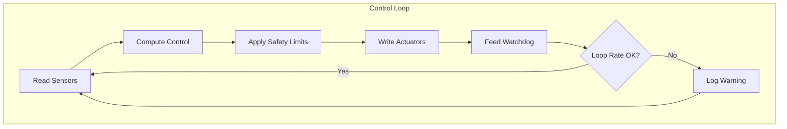
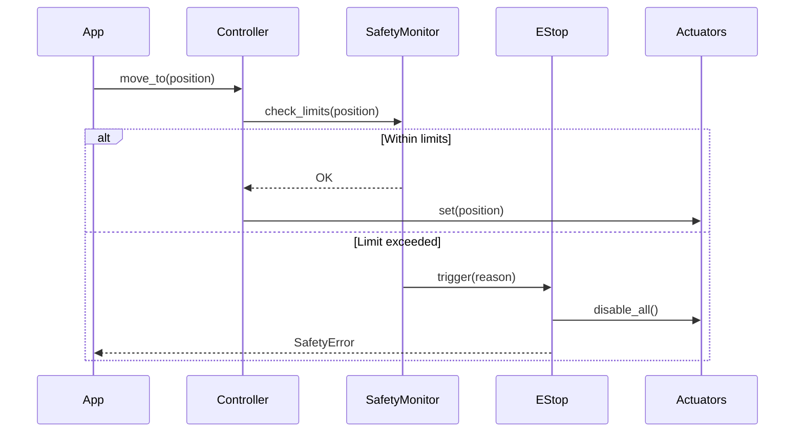
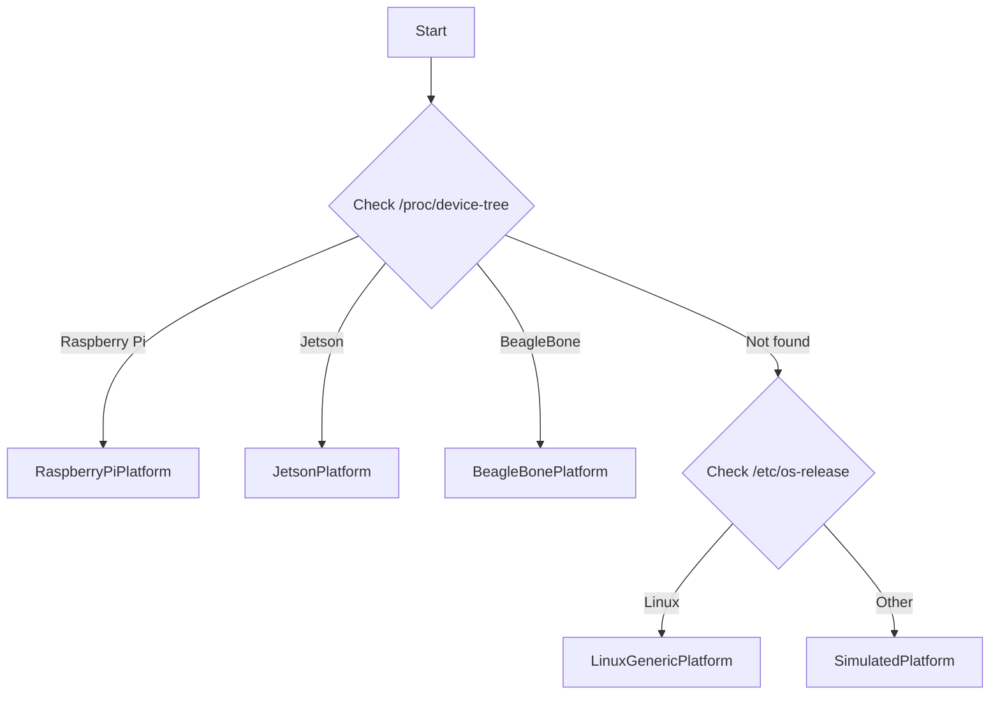

# Architecture Overview

robo-infra provides a layered architecture for building robotics applications. The design separates concerns into distinct layers, enabling hardware independence, testability, and extensibility.

## System Architecture

```
┌─────────────────────────────────────────────────────────────────────┐
│                        Application Layer                            │
│  (Your robot logic, behaviors, missions, AI integration)            │
├─────────────────────────────────────────────────────────────────────┤
│                       Controllers Layer                             │
│  JointGroup │ DifferentialDrive │ Gripper │ Quadcopter │ Custom    │
├─────────────────────────────────────────────────────────────────────┤
│           Actuators              │              Sensors             │
│  Servo │ DCMotor │ Stepper      │  IMU │ Encoder │ Distance │ GPS  │
├─────────────────────────────────────────────────────────────────────┤
│                         Drivers Layer                               │
│  PCA9685 │ L298N │ Dynamixel │ ODrive │ BNO055 │ Custom            │
├─────────────────────────────────────────────────────────────────────┤
│                          Bus Layer                                  │
│        I2C    │    SPI    │    Serial    │    CAN    │    GPIO     │
├─────────────────────────────────────────────────────────────────────┤
│                        Platform Layer                               │
│  RaspberryPi │ NVIDIA Jetson │ BeagleBone │ Linux/Windows │ Sim    │
└─────────────────────────────────────────────────────────────────────┘
```

## Module Hierarchy

The package is organized into functional modules, each with a clear responsibility:

### Core (`robo_infra.core`)

Base abstractions that everything else builds upon:

| Class | Purpose |
|-------|---------|
| `Actuator` | Abstract base for anything that moves (servo, motor, valve) |
| `Sensor` | Abstract base for anything that reads (encoder, IMU, camera) |
| `Controller` | Abstract base for coordinating actuators and sensors |
| `Driver` | Abstract base for hardware communication |
| `Bus` | Abstract base for I2C/SPI/Serial/CAN communication |

### Actuators (`robo_infra.actuators`)

Concrete implementations of physical outputs:

- **Servo** - PWM-controlled angular positioning
- **DCMotor** - Speed/direction control with H-bridge
- **Stepper** - Precise step-based positioning
- **BrushlessMotor** - ESC-controlled motors (drones, etc.)
- **LinearActuator** - Stroke-based linear motion
- **Solenoid** - On/off electromagnetic actuators
- **Valve** - Pneumatic/hydraulic flow control

### Sensors (`robo_infra.sensors`)

Concrete implementations of physical inputs:

- **Distance** - Ultrasonic, ToF, IR proximity
- **IMU** - Accelerometer, gyroscope, magnetometer
- **Encoder** - Quadrature, absolute position
- **Force/Torque** - Load cells, strain gauges
- **Environmental** - Temperature, humidity, pressure
- **Camera** - USB, CSI, depth cameras
- **LiDAR** - 2D scanning, 3D point cloud
- **GPS** - NMEA, RTK positioning

### Controllers (`robo_infra.controllers`)

High-level coordination of multiple actuators:

- **JointGroup** - Multi-axis arm control
- **DifferentialDrive** - Two-wheel mobile robots
- **Hexapod** - Six-legged walking robots
- **Quadcopter** - Four-motor flight control
- **Gripper** - Open/close with force sensing
- **PanTilt** - Two-axis camera mount

### Drivers (`robo_infra.drivers`)

Hardware-specific communication implementations:

- **PWM Drivers** - PCA9685, GPIO PWM
- **Motor Drivers** - L298N, TB6612, TMC2209
- **Smart Servos** - Dynamixel, ODrive
- **IMU Drivers** - BNO055, MPU6050, ICM20948
- **Platform** - Arduino, GPIO

### Safety (`robo_infra.safety`)

Protection mechanisms:

- **EStop** - Emergency stop system
- **Watchdog** - Heartbeat monitoring
- **Limits** - Enforced motion boundaries
- **SafetyMonitor** - Current, temperature monitoring

## Data Flow

### Command Flow (Output)

Commands flow from application logic down to hardware:

```
Application
    │
    ▼
Controller.move_to(position)
    │
    ├──► Validate against safety limits
    │
    ▼
Actuator.set(value)
    │
    ├──► Clamp to configured limits
    │
    ▼
Driver.write_channel(channel, raw_value)
    │
    ├──► Convert to hardware-specific format
    │
    ▼
Bus.write(address, data)
    │
    ▼
Physical Hardware
```

### Feedback Flow (Input)

Sensor readings flow from hardware up to application:

```
Physical Hardware
    │
    ▼
Bus.read(address, length)
    │
    ▼
Driver.read_channel(channel)
    │
    ├──► Parse hardware-specific format
    │
    ▼
Sensor.read()
    │
    ├──► Apply calibration, filtering
    │
    ▼
Controller.get_state()
    │
    ├──► Aggregate multiple sensors
    │
    ▼
Application
```

## Dependency Structure

robo-infra is designed with minimal dependencies at the core, with optional extras for specific hardware:

```
robo-infra (core)
├── pydantic          # Configuration and validation
├── numpy             # Math operations
└── typing-extensions # Type hints
    
robo-infra[hardware]
├── smbus2            # I2C communication
├── spidev            # SPI communication  
├── pyserial          # Serial/UART
├── RPi.GPIO          # Raspberry Pi GPIO
└── python-can        # CAN bus support

robo-infra[vision]
├── opencv-python     # Image processing
└── numpy             # Array operations

robo-infra[ai]
├── ai-infra          # LLM integration
└── httpx             # API calls

robo-infra[all]
└── (all above)
```

## Extension Points

robo-infra is designed to be extended at multiple levels:

### 1. Custom Actuators

Extend `Actuator` base class for new actuator types:

```python
from robo_infra.core.actuator import Actuator
from robo_infra.core.types import Limits

class MyCustomActuator(Actuator):
    def __init__(self, name: str, driver, channel: int):
        super().__init__(
            name=name,
            driver=driver,
            channel=channel,
            limits=Limits(min_value=0, max_value=100),
        )
    
    def set(self, value: float) -> None:
        # Your custom logic here
        clamped = self._clamp_to_limits(value)
        self.driver.write_channel(self.channel, clamped / 100)
    
    def get(self) -> float:
        return self.driver.read_channel(self.channel) * 100
```

### 2. Custom Drivers

Register new drivers with the driver registry:

```python
from robo_infra.core.driver import Driver, register_driver

@register_driver("my_motor_driver")
class MyMotorDriver(Driver):
    def __init__(self, bus, address: int = 0x60):
        super().__init__(name="MyDriver", channels=4)
        self.bus = bus
        self.address = address
    
    def connect(self) -> None:
        self._connected = True
    
    def disconnect(self) -> None:
        self._connected = False
    
    def _write_channel(self, channel: int, value: float) -> None:
        reg = 0x10 + channel
        self.bus.write_byte(self.address, reg, int(value * 255))
```

### 3. Custom Controllers

Build complex robot controllers by composing actuators:

```python
from robo_infra.core.controller import Controller

class MyRobotArm(Controller):
    def __init__(self, joints: list):
        super().__init__(name="arm")
        for i, joint in enumerate(joints):
            self.add_actuator(f"joint_{i}", joint)
    
    async def move_to_pose(self, pose: dict) -> None:
        for name, angle in pose.items():
            await self.actuators[name].move_to(angle)
```

### 4. Custom Sensors

Add new sensor types by extending `Sensor`:

```python
from robo_infra.core.sensor import Sensor
from robo_infra.core.types import Reading, Unit

class CO2Sensor(Sensor):
    def __init__(self, driver, channel: int):
        super().__init__(
            name="co2",
            unit=Unit.PPM,
            driver=driver,
            channel=channel,
        )
    
    def read(self) -> Reading:
        raw = self.driver.read_channel(self.channel)
        ppm = self._convert_to_ppm(raw)
        return Reading(value=ppm, unit=Unit.PPM)
```

## Simulation Mode

Every component supports simulation mode for development without hardware:

```python
import os
os.environ["ROBO_SIMULATION"] = "true"

# Now all components work without real hardware
from robo_infra.actuators import Servo
servo = Servo(name="test", channel=0)
servo.enable()
servo.set(90)  # Works in simulation
```

The simulation layer:
- Validates all commands and limits
- Tracks state changes
- Returns sensible simulated readings
- Enables CI/CD testing without hardware

## Thread Safety

Controllers and sensors support both sync and async patterns:

```python
# Synchronous usage
servo.set(90)
position = servo.get()

# Asynchronous usage
await servo.move_to(90)
position = await servo.get_async()

# Streaming sensor data
async for reading in sensor.stream(rate_hz=100):
    process(reading)
```

## Next Steps

- [Core Concepts](core-concepts.md) - Understand the fundamental patterns
- [Getting Started](getting-started.md) - Build your first robot
- [Controllers](controllers.md) - Coordinate multiple actuators
- [Safety](safety.md) - Implement safety systems

---

## Control Loop Architecture

### Real-Time Control Loop

The control loop is the heart of any robotics system:



### PID Control Integration

```python
from robo_infra.motion import PID
from robo_infra.safety import Watchdog, ControlLoopTimer

pid = PID(kp=1.0, ki=0.1, kd=0.05)
watchdog = Watchdog(timeout=0.1)  # 100ms timeout
timer = ControlLoopTimer(target_hz=100)  # 100 Hz loop

watchdog.start()

try:
    while running:
        with timer:
            # Read sensor
            position = encoder.read()
            
            # Compute control
            output = pid.update(setpoint=target, measurement=position)
            
            # Apply to actuator
            motor.set_speed(output)
            
            # Feed watchdog
            watchdog.feed()
finally:
    watchdog.stop()
    motor.stop()
```

### Loop Timing

```
Target: 1000 Hz (1ms period)
┌────────────────────────────────────────────────────────────────┐
│ Read     │ Compute  │ Safety   │ Write    │ Wait              │
│ ~0.001ms │ ~0.001ms │ ~0.001ms │ ~0.001ms │ ~0.996ms          │
└────────────────────────────────────────────────────────────────┘
│<──────────────────── 1ms ─────────────────────────────────────>│
```

---

## Safety System Integration

### Safety Architecture

```
┌─────────────────────────────────────────────────────────────────────┐
│                         Safety Monitor                              │
│  ┌─────────────┐  ┌─────────────┐  ┌─────────────┐                 │
│  │ Limit Check │  │ Watchdog    │  │ Collision   │                 │
│  │ Enforcer    │  │ Timer       │  │ Detector    │                 │
│  └──────┬──────┘  └──────┬──────┘  └──────┬──────┘                 │
│         │                │                │                         │
│         └────────────────┼────────────────┘                         │
│                          ▼                                          │
│                    ┌──────────┐                                     │
│                    │  E-Stop  │◄─── Hardware E-Stop Button          │
│                    └────┬─────┘                                     │
│                         │                                           │
├─────────────────────────┼───────────────────────────────────────────┤
│                         ▼                                           │
│              All Registered Actuators                               │
│         (Disabled when E-Stop triggered)                            │
└─────────────────────────────────────────────────────────────────────┘
```

### Safety Integration Flow



### E-Stop Recovery

```python
from robo_infra.safety import EStop, EStopConfig

estop = EStop(config=EStopConfig(
    name="main",
    require_manual_reset=True,
))

# Register actuators
estop.register(motor1)
estop.register(motor2)
estop.register(servo1)

# Handle E-stop events
@estop.on_trigger
def on_estop(event):
    logger.critical(f"E-STOP: {event.reason}")
    notify_operator()

# Recovery procedure
def recover():
    if not estop.is_triggered:
        return
    
    # 1. Verify safe conditions
    verify_safe_conditions()
    
    # 2. Reset E-stop
    estop.reset()
    
    # 3. Re-enable actuators
    for actuator in actuators:
        actuator.enable()
```

---

## Platform Abstraction Layer

### Platform Detection



### Platform Interface

```python
from abc import ABC, abstractmethod

class Platform(ABC):
    @abstractmethod
    def get_gpio(self, pin: int) -> GPIOPin:
        """Get a GPIO pin interface."""
        ...
    
    @abstractmethod
    def get_i2c(self, bus: int) -> I2CBus:
        """Get an I2C bus interface."""
        ...
    
    @abstractmethod
    def get_spi(self, bus: int, device: int) -> SPIDevice:
        """Get an SPI device interface."""
        ...
    
    @abstractmethod
    def get_pwm(self, pin: int) -> PWMChannel:
        """Get a PWM channel interface."""
        ...
    
    @property
    @abstractmethod
    def capabilities(self) -> set[PlatformCapability]:
        """Return platform capabilities."""
        ...
```

### Platform-Specific Implementations

```
Platform Interface
        │
        ├── RaspberryPiPlatform
        │   ├── RPi.GPIO for digital I/O
        │   ├── pigpio for hardware PWM
        │   ├── smbus2 for I2C
        │   └── spidev for SPI
        │
        ├── JetsonPlatform
        │   ├── Jetson.GPIO for digital I/O
        │   ├── jetson-stats for monitoring
        │   └── nvpmodel for power modes
        │
        ├── BeagleBonePlatform
        │   ├── Adafruit_BBIO for GPIO/PWM
        │   ├── PRU support for real-time
        │   └── Device tree overlays
        │
        ├── LinuxGenericPlatform
        │   ├── sysfs GPIO interface
        │   ├── /dev/i2c-* for I2C
        │   └── /dev/spidev* for SPI
        │
        └── SimulatedPlatform
            ├── In-memory GPIO state
            ├── Simulated bus responses
            └── Configurable behavior
```

### Automatic Platform Selection

```python
from robo_infra.platforms import get_platform, detect_platform

# Auto-detect current platform
platform = get_platform()
print(f"Running on: {platform.name}")
print(f"Capabilities: {platform.capabilities}")

# Get hardware interfaces
gpio = platform.get_gpio(17)
i2c = platform.get_i2c(1)
pwm = platform.get_pwm(18)

# Platform-agnostic code
gpio.set_mode("output")
gpio.write(True)
```

### Simulation Fallback

```python
import os
os.environ["ROBO_SIMULATION"] = "1"

from robo_infra.platforms import get_platform

# Returns SimulatedPlatform even on real hardware
platform = get_platform()
assert platform.is_simulated

# All operations work but don't touch hardware
gpio = platform.get_gpio(17)
gpio.set_mode("output")
gpio.write(True)  # No-op, just logs
```
