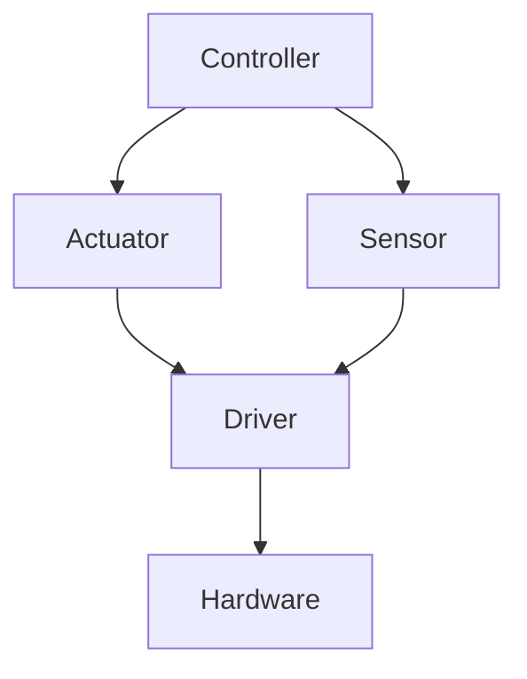

# Documentation Standards

This guide defines the standards for writing and maintaining robo-infra documentation.

## File Organization

### Directory Structure

```
docs/
├── index.md                  # Main landing page
├── getting-started.md        # Quick start guide
├── architecture.md           # System architecture
├── core-concepts.md          # Fundamental concepts
├── actuators.md              # Actuator types
├── sensors.md                # Sensor types
├── drivers.md                # Driver documentation
├── controllers.md            # Controller types
├── safety.md                 # Safety systems
├── motion.md                 # Motion planning
├── kinematics.md             # Kinematics
├── vision.md                 # Vision systems
├── protocols.md              # Industrial protocols
├── power.md                  # Power management
├── ros2-integration.md       # ROS2 integration
├── observability.md          # Metrics/logging
├── cli.md                    # CLI reference
├── utils.md                  # Utility modules
├── reference/
│   └── api.md                # Auto-generated API docs
└── contributing/
    └── documentation.md      # This file
```

### File Naming Conventions

| Type | Convention | Examples |
|------|------------|----------|
| Guides | lowercase-kebab-case | `getting-started.md`, `core-concepts.md` |
| Reference | lowercase-kebab-case | `api.md`, `changelog.md` |
| Folders | lowercase | `reference/`, `contributing/` |

**Do NOT use:**
- UPPERCASE names (except README.md at root)
- snake_case for documentation files
- Spaces in filenames

## Document Structure

### Standard Template

Every documentation file should follow this structure:

```markdown
# Title

Brief one-line description of what this document covers.

## Overview

2-3 paragraphs explaining the purpose, key concepts, and when to use this feature.

## Section 1

### Subsection 1.1

Content with code examples.

### Subsection 1.2

More content.

## Section 2

...

## Examples

Complete, runnable examples.

## Best Practices

Numbered or bulleted list of recommendations.

## See Also

- [Related Doc 1](related-doc-1.md)
- [Related Doc 2](related-doc-2.md)
```

### Heading Levels

| Level | Usage |
|-------|-------|
| `#` (H1) | Document title only (one per file) |
| `##` (H2) | Major sections |
| `###` (H3) | Subsections |
| `####` (H4) | Minor subsections (use sparingly) |

## Code Examples

### Requirements

Every documentation file must include:
- At least 2 complete, runnable code examples
- Examples should be copy-paste ready
- Include imports in every example

### Code Block Format

````markdown
```python
from robo_infra.actuators import Servo
from robo_infra.drivers import PCA9685Driver

# Create driver
driver = PCA9685Driver()

# Create servo
servo = Servo("gripper", channel=0, driver=driver)
servo.angle = 45
```
````

### Code Comments

Include comments explaining non-obvious code:

```python
# [OK] Good - explains why
servo.set_speed(0.5)  # Reduce speed for precision gripping

# [X] Bad - just restates the code
servo.set_speed(0.5)  # Set speed to 0.5
```

### Error Handling Examples

Always show error handling:

```python
from robo_infra.core.exceptions import CommunicationError

try:
    servo.move_to(target)
except CommunicationError as e:
    logger.error(f"Failed to move servo: {e}")
    servo.stop()
```

## Tables

### Standard Table Format

```markdown
| Column 1 | Column 2 | Column 3 |
|----------|----------|----------|
| Value 1  | Value 2  | Value 3  |
| Value 4  | Value 5  | Value 6  |
```

### Common Table Types

**Feature comparison:**

| Feature | Servo | DCMotor | Stepper |
|---------|-------|---------|---------|
| Position control | [OK] | [X] | [OK] |
| Continuous rotation | [X] | [OK] | [OK] |
| Holding torque | [X] | [X] | [OK] |

**API summary:**

| Method | Description | Returns |
|--------|-------------|---------|
| `move_to(pos)` | Move to position | `None` |
| `stop()` | Stop immediately | `None` |
| `status()` | Get current status | `Status` |

## Diagrams

### When to Use Diagrams

Include diagrams for:
- System architecture
- Data flow
- State machines
- Hardware connections
- Kinematic chains

### Mermaid Format

Use Mermaid for diagrams:

````markdown

````

### Diagram Guidelines

1. Keep diagrams simple (max 10-15 nodes)
2. Use clear, descriptive labels
3. Include legend if using colors/shapes
4. Test diagram renders correctly

## Links

### Internal Links

Use relative paths:

```markdown
See [Actuators](actuators.md) for more details.
See [API Reference](reference/api.md) for the full API.
```

### External Links

Use descriptive text:

```markdown
See the [ROS2 documentation](https://docs.ros.org/) for more.
```

### Anchor Links

Link to specific sections:

```markdown
See [Circuit Breaker](utils.md#circuit-breaker) for details.
```

## Admonitions

### Types

Use MkDocs admonitions for callouts:

```markdown
!!! note
    This is a note with additional information.

!!! warning
    This is a warning about potential issues.

!!! danger
    This is critical safety information.

!!! tip
    This is a helpful tip or best practice.

!!! example
    This is an example block.
```

### When to Use

| Type | Use For |
|------|---------|
| `note` | Additional context, FYI |
| `tip` | Best practices, recommendations |
| `warning` | Potential issues, gotchas |
| `danger` | Safety concerns, breaking changes |
| `example` | Extended examples |

## Writing Style

### Voice and Tone

- Use second person ("you") for instructions
- Use active voice
- Be concise and direct
- Avoid jargon; explain technical terms

### Examples

```markdown
# [OK] Good
You can create a servo using the Servo class.

# [X] Bad
A servo can be created by the user using the Servo class.
```

### Technical Writing Guidelines

1. **One concept per paragraph** - Don't overload paragraphs
2. **Lead with the action** - Start sentences with verbs in instructions
3. **Use lists for steps** - Numbered for sequential, bullets for non-sequential
4. **Define acronyms** - Spell out on first use: "Pulse Width Modulation (PWM)"

## API Documentation

### Docstring Format

Use Google-style docstrings:

```python
def move_to(self, position: float, speed: float = 1.0) -> None:
    """Move the actuator to the specified position.

    Args:
        position: Target position in degrees.
        speed: Movement speed from 0.0 to 1.0.

    Raises:
        ValueError: If position is outside limits.
        CommunicationError: If hardware communication fails.

    Example:
        >>> servo.move_to(45.0, speed=0.5)
    """
```

### Required Sections

| Section | Required | Description |
|---------|----------|-------------|
| Summary | [OK] | One-line description |
| Args | [OK] if args | Parameter descriptions |
| Returns | [OK] if returns | Return value description |
| Raises | [OK] if raises | Exceptions that may be raised |
| Example | Recommended | Usage example |
| Note | Optional | Additional information |

## Review Checklist

Before submitting documentation:

- [ ] File follows naming conventions
- [ ] Document has proper heading structure
- [ ] At least 2 complete code examples included
- [ ] All code examples are tested and work
- [ ] Links are correct and working
- [ ] Tables render correctly
- [ ] Diagrams (if any) render correctly
- [ ] No spelling/grammar errors
- [ ] Technical accuracy verified
- [ ] "See Also" section with related docs

## Building Documentation

### Local Preview

```bash
# Install MkDocs
pip install mkdocs mkdocs-material mkdocstrings[python]

# Serve locally
mkdocs serve

# Build static site
mkdocs build
```

### Checking Links

```bash
# Check for broken links
mkdocs build --strict
```

## Updating docs-changelog.json

When documentation changes, update the changelog:

```bash
# Run the docs-changelog workflow
make docs-changelog

# Or manually update
python scripts/update_docs_changelog.py
```

The `docs-changelog.json` file tracks:
- Document additions
- Document modifications
- Version information

## See Also

- [Contributing Guide](../../CONTRIBUTING.md) - General contribution guidelines
- [Architecture](../architecture.md) - System architecture overview
- [API Reference](../reference/api.md) - Full API documentation
