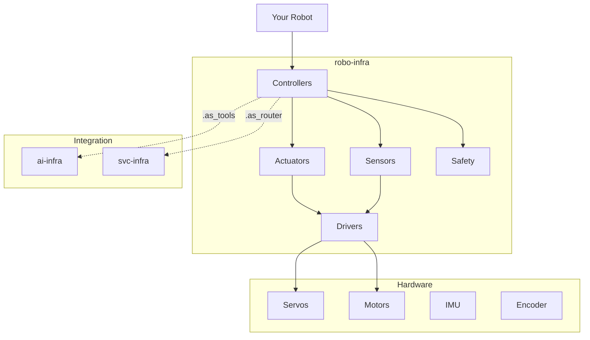

# robo-infra

**Universal robotics infrastructure package for any robotics project**

robo-infra is a hardware-agnostic robotics SDK that works with any servo, motor, or sensor. From a $5 servo to industrial PLCs - same code works everywhere.

## Features

<div class="grid cards" markdown>

-   :material-robot-industrial:{ .lg .middle } **Actuators**

    ---

    Servo, DC Motor, Stepper, Brushless, Linear, Solenoid, Valve.

    [:octicons-arrow-right-24: Actuators docs](actuators.md)

-   :material-eye:{ .lg .middle } **Sensors**

    ---

    Distance, IMU, Encoder, Force, Temperature, Camera, GPS.

    [:octicons-arrow-right-24: Sensors docs](sensors.md)

-   :material-chip:{ .lg .middle } **Drivers**

    ---

    PCA9685, L298N, MPU6050, and plugin system for any hardware.

    [:octicons-arrow-right-24: Drivers docs](drivers.md)

-   :material-shield:{ .lg .middle } **Safety**

    ---

    E-Stop, Watchdog, Current Monitoring, Limit Enforcement.

    [:octicons-arrow-right-24: Safety docs](safety/index.md)

-   :material-controller:{ .lg .middle } **Controllers**

    ---

    JointGroup, DifferentialDrive, Quadcopter, and more.

    [:octicons-arrow-right-24: Controllers docs](controllers.md)

-   :material-brain:{ .lg .middle } **AI Integration**

    ---

    LLM-controllable robots via ai-infra tools.

    [:octicons-arrow-right-24: AI Integration docs](ai-integration.md)

</div>

## Quick Start

```python
from robo_infra import Servo, JointGroup

# Create a simple servo
servo = Servo(name="gripper", angle_range=(0, 90))
servo.enable()
servo.set(45)  # Move to 45 degrees

# Create a robot arm
arm = JointGroup([
    Servo(name="base", angle_range=(0, 180)),
    Servo(name="shoulder", angle_range=(0, 180)),
    Servo(name="elbow", angle_range=(0, 180)),
    Servo(name="wrist", angle_range=(0, 180)),
])
arm.enable_all()
arm.home()  # Move all to default positions
```

## Installation

```bash
pip install robo-infra
```

## Simulation First

Everything works without real hardware:

```bash
# Enable simulation mode
export ROBO_SIMULATION=true

# Now all your code runs in simulation
python my_robot.py
```

## Safety First

robo-infra is built with safety as a core principle:

```python
from robo_infra.safety import EStop, Watchdog

# Create E-stop
estop = EStop()
estop.register_actuator(servo)
estop.register_actuator(arm)

# Trigger E-stop (disables ALL actuators immediately)
estop.trigger("User pressed emergency button")

# Watchdog for control loops
watchdog = Watchdog(timeout=0.1, estop=estop)
watchdog.start()

while running:
    do_control_update()
    watchdog.feed()  # Must call every 100ms
```

## Architecture



## Supported Hardware

| Category | Hardware |
|----------|----------|
| PWM Drivers | PCA9685, GPIO PWM |
| Motor Drivers | L298N, TB6612, TMC2209 |
| IMUs | MPU6050, BNO055 |
| Distance | HC-SR04, VL53L0X |
| Platforms | Raspberry Pi, Jetson, Arduino, ESP32 |

## License

MIT License - see [LICENSE](https://github.com/nfraxlab/robo-infra/blob/main/LICENSE) for details.
